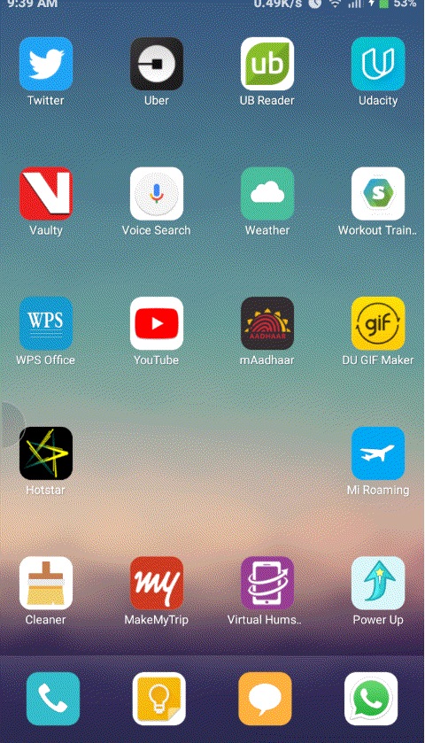

# Government Job Pedia
Every Ministry and Government agency has its own Recruitment Board which announces vacancies via separate mediums.

This project involves creating a unified portal for the government to display a list of available vacancies and the users to view all the information and apply for the same.

It consists of an Android Application and a Web Portal. The Android App displays the available jobs according to user preferences, while the Web Portal is built to announce the available vacancies by various Ministries and Government agencies.

Successful completion and implementation of this project could help both the government and its job seekers.

## Demo (Android App)

## Screenshots (Web Portal)

